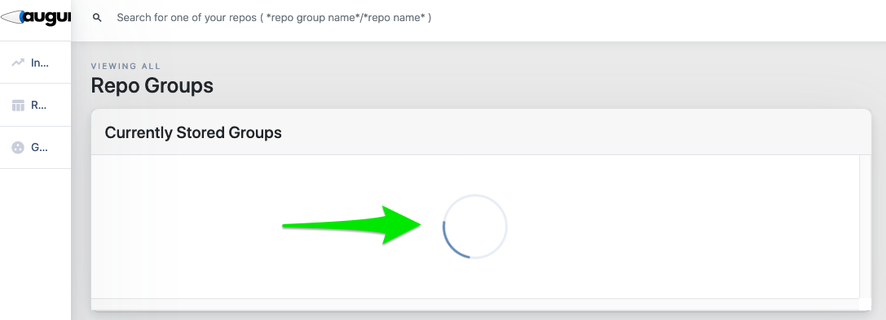

# Sprint 2

**CRITICAL UPDATE** 

For this sprint I am as of right now still working with our server provider to fix the issue where you cannot see the pages live on your site. So: 

1. Submit the URL that your server is running at as the assignement. We will, if things are not working or I don't get help by this evening, login to your server and check that you are able to run augur. 
2. There are two ways to run augur: 
    - `make dev` will run a development server
    - `nohup augur run >augur.log 2>augur.err &` will leave the augur server running in the background. If you need to kill a server started this way, use the command `augur util kill`. You would do this to recompile after changes, for example. 
3. If you have everything loaded, you should see something like this when you try to hit your server's IP address (until I get the networking issues sorted out):

4. We will be looking at your GitHub repositories that we created for you to assess the code you submitted. 
5. Grades for sprint 2 will be derived from how your group completed the requirements for the type of project you have. As in the past, we will allow you to clarify anything we observe to be missing in a revision. **Be sure that your repository has a README.md that makes the scope of your OVERALL project clear, and also identifies what we should expect to see completed in this sprint.** 

## Basics
1. All submissions in the GitHub repository created for you for this class. 
2. Your primary objective in this sprint is to get something working and deployed. 
    - We will cover Augur deployment on your servers in class on Thursday this week. 
    - Tuesday, you will need to be in your teams and decide what you are going to prototype. 
3. The goal is to get something *working* and *deployed*. That something should be an elementary, early version of something you want to build. _Something_ is defined as a metrics display, a new endpoint, or discernible progress on back end work (mostly these are individual projects). 
4. Create a "sprint-2" folder in your Augur repositories. In that folder place: 
    - A README.md file that explains what you are doing in this sprint, and provides a detailed description of the intended design. "Detailed" should keep in mind that you are building something that is "in addition to" the base code that you have to work with, so you do not need to specify/design the system. Only your intended additions to it. 
    - Make changes to this document as you work so that your progress can be monitored by your team mates. 
5. Ensure that everyone on  your team has a their own branch on your repository. 
6. Turn in a public link where your project will be working. We assume we can see the code in your GitHub repos. **YOU ONLY NEED IT DEPLOYED ON ONE SERVER PER GROUP**
7. **Make any additions or updates requested by Sean and Caleb to your sprint 1 deliverables.**

## Full Stack Teams
1. Identify three work items you will deploy as your "hello world" this week. These should include at least 1 UI component and one API component. 
2. For Front end: If you are working in your own web app and not deploying the front end in Augur the expectations are that your design will be more highly functional than if you put it inside Augur. Basically, you can choose the complexity of building it in Augur, or the complexity of delivering a more impressive front end than what you see in Augur. Honestly, this should not be too hard. 

## API Teams
1. Identify 3 APIs that you will build for the project. Submit those for review via slack to Dr. Goggins by Thursday morning. 
2. Decide on what the routes.py stubs will be for these endpoints and implement them 
3. Implement one endpoint fully. It does not have to be correct at this point. 

## Frontend Teams
1. Identify 3 front end designs that you will build for the project. These can be different than your sprint 1 proposal if you decide to make a change. (commit to the data and some type of graph for each one. They can be the same, but they should not be a line graph of data already displayed on Augur.)
2. Decide where each proposed new front end piece will fit in the Augur design. You don't have to put it directly in Augur right now, but you should think about where it fits in the overall information architecture. 
3. Implement one UI page fully. It does not need to be correct or fully functional, but it should show *some* actual data. 
4. If you are working in your own web app and not deploying the front end in Augur the expectations are that your design will be more highly functional than if you put it inside Augur. Basically, you can choose the complexity of building it in Augur, or the complexity of delivering a more impressive front end than what you see in Augur. Honestly, this should not be too hard. 

## Individual Teams
1. Make a commit to your repository illustrating progress on the issue or issues you have selected. 
2. Make an appointment with Dr. Goggins to review your selected issue. 
