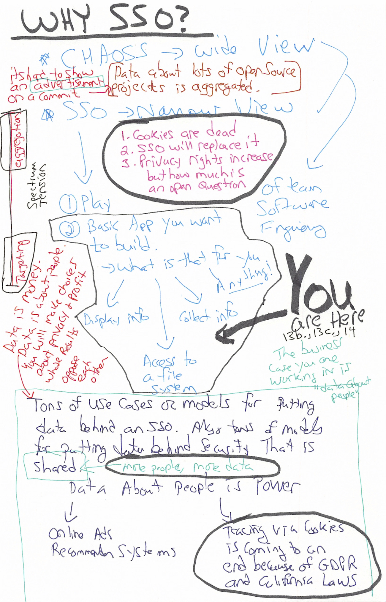

# Assignment 13b: Team Sprint 5 : Spring 2020 : CS4320/7320 Software Engineering
**NOTE: We are going to be working through SSO the rest of the semester. BUT, if you have another specific project you want to work on that is either open source, or could be, I am open to your pitch. These are unprecedented times and I think following through on any CHAOSS submissions or other open source contributions are the most effective mechanisms for experiencing team software engineering ... The SSO Thread, as I explain in the first video, is one that is complex, but I think will be personally valuable to you in the long run**

 [**I provide a brief overview of the "rest of the way" in the course using the diagram above, but with _annotation_ AND _narration_ here!](../lecture-notes/19.-13b-intro.mp4) and on [Vimeo](https://vimeo.com/413390602)

## Make A Login Server, and A Basic Example App 
1. I created a directory for my own fork of the dex project, but you can clone the original or your own fork.  You might want to clone my fork, just to make sure yours works the same. So, my directory for projects I fork is `$HOME/github/sgoggins` because that's my github username. 
2. `cd $HOME/github/sgoggins`
3. `virtualenv --python=python3 ../virtualenvs/dex` : This can be wherever you keep your python virtual environments. I keep mine at the root of my $HOME/github directory, so it would be `$HOME/virtualenvs/dex` in this case. 
4. `source ../virtualenvs/dex/bin/activate` : Then you activate it. 
5. `git clone https://github.com/sgoggins/dex.git`
6. Make sure  you have `go` installed using the command `which go` If you do not have `go` the language installed, or in your path, instructions are here: `https://golang.org/doc/install`
7. `cd dex` puts you in the project directory. 
8.  `make` will build your project for you
9. `./bin/dex serve examples/config-dev.yaml` will start the **OPENID Connect Provider** 
10. `./bin/example-app` will run the sample **OPENID Connect App**. 

 [**You can see a demonstration of these steps on this video**](../lecture-notes/21.-example-go.mp4) and on [Vimeo](https://vimeo.com/413390672)

## The Dex Project does a good job of explaining the various moving parts in a single sign on system. 
1. [Building Apps Using Dex](https://github.com/sgoggins/dex/blob/master/Documentation/using-dex.md)
2. [Getting Started](https://github.com/sgoggins/dex/blob/master/Documentation/getting-started.md)
3. [An Overview of OPENID Connect in Dex](https://github.com/sgoggins/dex/blob/master/Documentation/openid-connect.md)
4. [Detailed Scopes and Attributes](https://github.com/sgoggins/dex/blob/master/Documentation/custom-scopes-claims-clients.md) **This is really important for understanding what data is being "given away" when you sign on. The European Union and California have created policies driving the shift from cookies to greater transparency about your data** 

## Building an App
 [**You can see a demonstration of these steps on this video**](https://vimeo.com/413390218)
0. The Video walks you through the steps below, and it may be helpful to go back and forth between them. 
1. Change to the `MU-Software-Engineering/lecture-labs/13b.-example` directory. [This activity is based on an article on RealPython.com](https://realpython.com/flask-google-login/#creating-your-own-web-application). I have attempted to simplify the process. 
2. Create a python virtual environment. Name it something you will recall the purpose of, like `seng-sprint5`. When I did it from the course directory, I had to "go back" several directories to get to my `virtualenvs` ... like this `virtualenv --python=python3 ../../../../virtualenvs/seng-sprint5`
3. We are going to be using [Flask]() and the [Flask-Login](https://flask-login.readthedocs.io/en/latest/) modules with Google authentication. 
4. Once you have created your virtualenv, activate it. I had to do this: `source  ../../../../virtualenvs/seng-sprint5/bin/activate`, remembering I keep **everything** in a `github` directory, and `virtualenvs` is a subdirectory of that one. So when I clone our course there, that's what I get. 
5. Then I install all the libraries in the `requirements.txt` file with `pip install -r requirements.txt`
6. Next, you initialize the database by typing `python app.py`. 
7. You should see **initialized the database**
8. Now, you need to go to google to authorize an "app". https://console.developers.google.com/apis/credentials
9. The remaining steps are in the video, and in the article from `realpython.com` I reference at the beginning. 

## Assignment
1. Create a `sprint-five` folder in your repository.
2. Within that folder, create a `my-google` folder, and copy the example. If you follow all the steps, I will be able to run your app. 
3. Within the `sprint-five` folder, create two documents: 
    - README.md - You *can* choose to use other technologies for SSO, and if you do, I need enough detail in the README.md to be able to understand how to run your login application.
    - GOALS.md - In this document, describe the purpose of your application, its core audience, and whether you will be collecting or displaying data; or neither. But make the audience and intention of your application clear. 
    - REFLECTION.md - SSO is a difficult set of concepts to grasp. Describe what worked, and what did not. Provide a list of sites you visited in your quest to understand and get your app going. If your app did not work (for SSO to Google OAUTH or other provider you selected), explain where you got stuck. Finally, briefly describe what you hope to have functioning with SSO, in terms of "your app", by the end of the semester. 

**Each document is important, but your reflections are, to me, the evidence that you are giving the application, and how SSO can be helpful within it some thought. It also helps  me understand where you struggle.  There is a fine line between the cognitive stress needed to learn, and cognitive stress that leads to emotional stress. And, in really unusual times, its often hard to tell the difference. Maintain awareness of that reality.**

